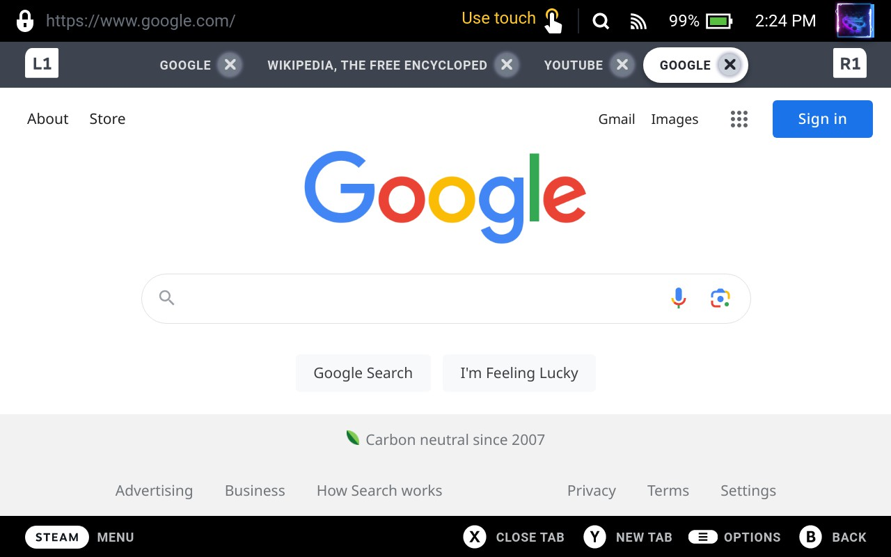
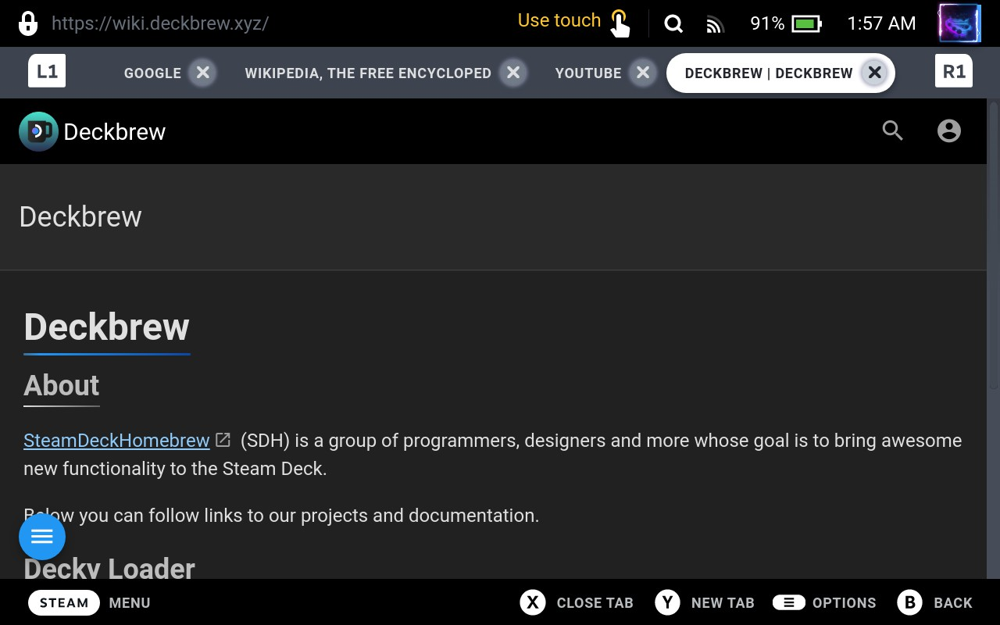
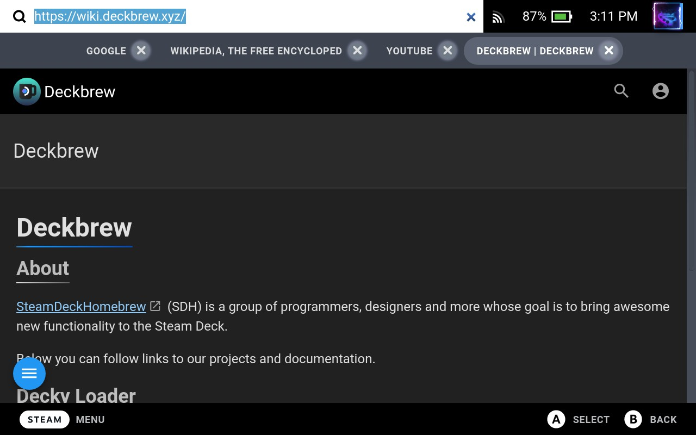
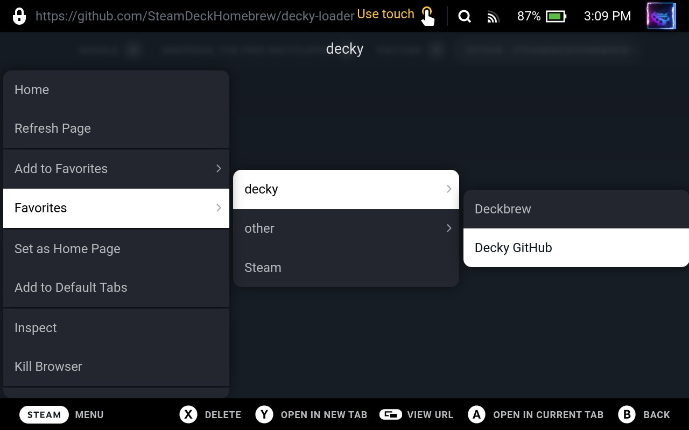
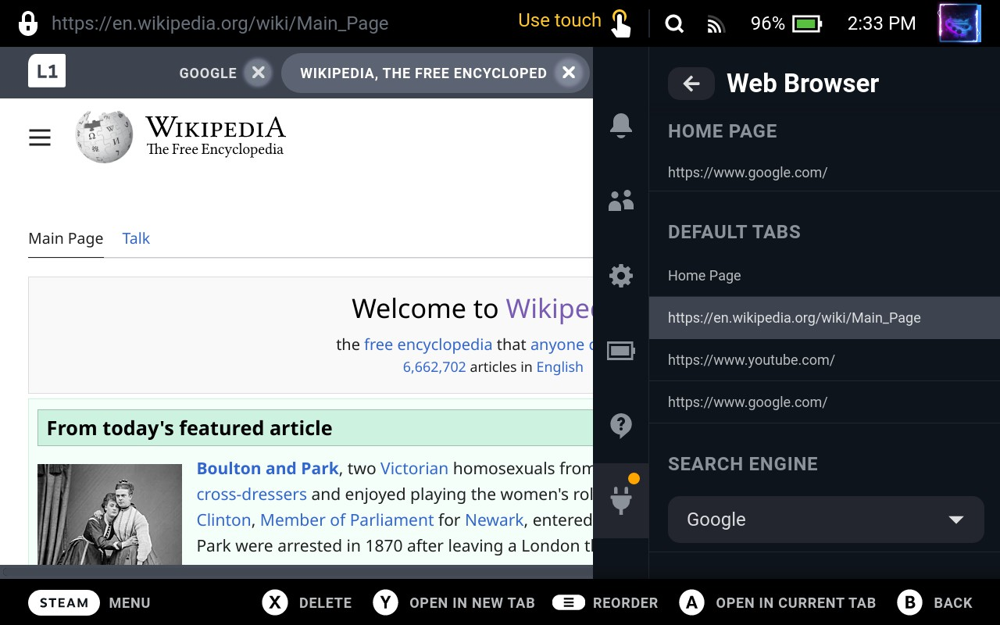
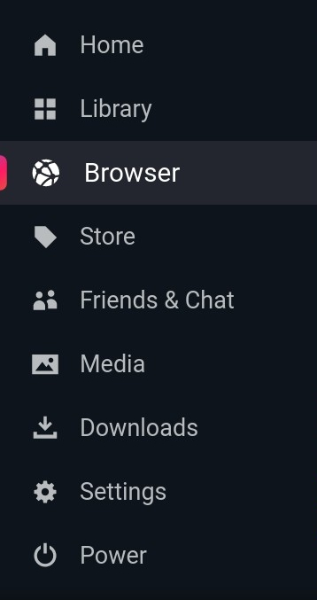
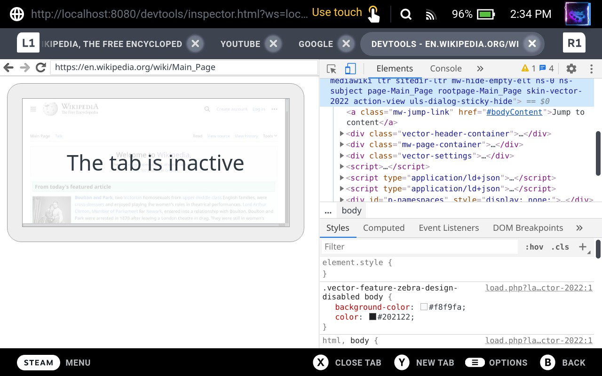
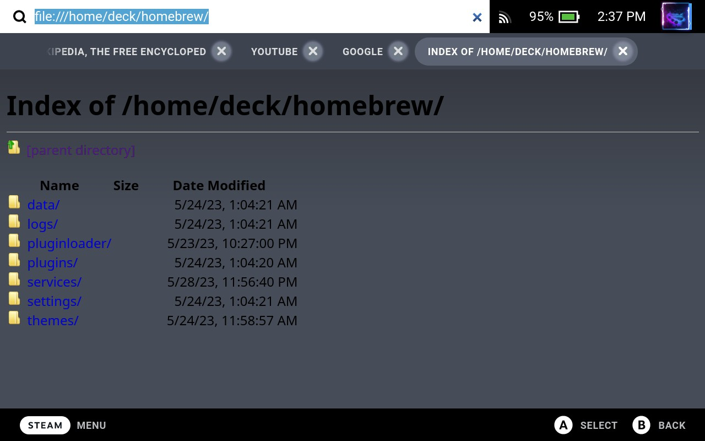
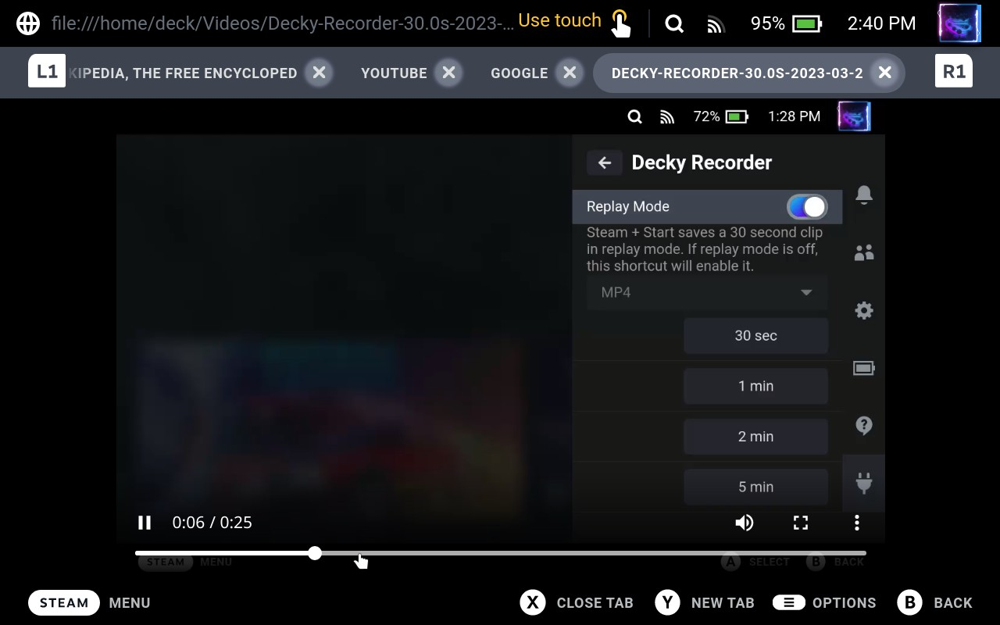

<h1 style="text-align: center;">Web Browser for Steam Deck</h1>

A multifeatured web broswer integegrated into the Steam Deck's game mode UI!

  <small>Find it in the <a href="https://wiki.deckbrew.xyz/en/user-guide/plugin-store">Decky Loader store</a></small>

 
 

<small>*WARNING: This plugin uses the Steam Deck's built in Chromium Embedded Framework. This version of CEF is known to have security flaws. Caution is advised when navigating to external and unreputable sites. Some sites may exploit these secrity flaws and allow malicious code to be executed on your device. Use at your own risk.*</small>

## Features

### Overview
- Multiple tabs
- Integrated search/ url bar with search engine of choice
- Create favorites (inclcuding folders for organization)
- User customizeable home page/ default tabs
- Easily launch via the Steam Deck menu
- Limited gamepad navigation support
- Backgrounding
- Inspect tabs/ use devtools
- Browse file system

### Tabs
Easily open, close and navigate between multiple tabs with just the touch of a button.

### Search/ URL Bar
Use the integrated Steam Deck search bar to search the web using the search engine of your choice or enter a url to navigate to directly.

### Favorites
Easily create favorites to save web pages and open them quickly from the context menu. You can even create folders and subfolders as many levels deep as you want to keep your favorites organized.

### Home Page/ Default Tabs
The set home page will automatically load when a new tab is opened. Custom default tabs can also be set, which will automatically be opened every time the browser starts.

### Main Menu Icon
An icon is added to the Steam Decks main menu to quickly access the browser.

### Gamepad Support
The browser makes use of the Steam Deck's controls to easily perform it's main tasks and also give the ability to navigate webpages that dont have gamepad support natively.

#### Full List of Controls

<picture><source media="(prefers-color-scheme: dark)" srcset="assets/button-icons/y-light.svg"><source media="(prefers-color-scheme: light)" srcset="assets/button-icons/y-dark.svg"></picture> Open a new tab

<picture><source media="(prefers-color-scheme: dark)" srcset="assets/button-icons/x-light.svg"><source media="(prefers-color-scheme: light)" srcset="assets/button-icons/x-dark.svg"></picture> Close tab

<picture><source media="(prefers-color-scheme: dark)" srcset="assets/button-icons/l1-light.svg"><source media="(prefers-color-scheme: light)" srcset="assets/button-icons/l1-dark.svg"></picture> /
<picture><source media="(prefers-color-scheme: dark)" srcset="assets/button-icons/r1-light.svg"><source media="(prefers-color-scheme: light)" srcset="assets/button-icons/r1-dark.svg"></picture> Previous/ Next tab

<picture><source media="(prefers-color-scheme: dark)" srcset="assets/button-icons/start-light.svg"><source media="(prefers-color-scheme: light)" srcset="assets/button-icons/start-dark.svg"></picture> Open context menu

<picture><source media="(prefers-color-scheme: dark)" srcset="assets/button-icons/l4-light.svg"><source media="(prefers-color-scheme: light)" srcset="assets/button-icons/l4-dark.svg"></picture> /
<picture><source media="(prefers-color-scheme: dark)" srcset="assets/button-icons/r4-light.svg"><source media="(prefers-color-scheme: light)" srcset="assets/button-icons/r4-dark.svg"></picture> Page back/ forward

<picture><source media="(prefers-color-scheme: dark)" srcset="assets/button-icons/l5-light.svg"><source media="(prefers-color-scheme: light)" srcset="assets/button-icons/l5-dark.svg"></picture> /
<picture><source media="(prefers-color-scheme: dark)" srcset="assets/button-icons/r5-light.svg"><source media="(prefers-color-scheme: light)" srcset="assets/button-icons/r5-dark.svg"></picture> "Tab" key/ "Shift" + "Tab" key (selects previous/ next element on page)

<picture><source media="(prefers-color-scheme: dark)" srcset="assets/button-icons/dpad_up-light.svg"><source media="(prefers-color-scheme: light)" srcset="assets/button-icons/dpad_up-dark.svg"></picture> /
<picture><source media="(prefers-color-scheme: dark)" srcset="assets/button-icons/dpad_down-light.svg"><source media="(prefers-color-scheme: light)" srcset="assets/button-icons/dpad_down-dark.svg"></picture> "Page Up"/ "Page Down" key

<picture><source media="(prefers-color-scheme: dark)" srcset="assets/button-icons/dpad_left-light.svg"><source media="(prefers-color-scheme: light)" srcset="assets/button-icons/dpad_left-dark.svg"></picture> /
<picture><source media="(prefers-color-scheme: dark)" srcset="assets/button-icons/dpad_right-light.svg"><source media="(prefers-color-scheme: light)" srcset="assets/button-icons/dpad_right-dark.svg"></picture> "Arrow Left"/ "Arrow Right" key

<picture><source media="(prefers-color-scheme: dark)" srcset="assets/button-icons/a-light.svg"><source media="(prefers-color-scheme: light)" srcset="assets/button-icons/a-dark.svg"></picture> "Enter" key

<picture><source media="(prefers-color-scheme: dark)" srcset="assets/button-icons/b-light.svg"><source media="(prefers-color-scheme: light)" srcset="assets/button-icons/b-dark.svg"></picture> If page has focus it will defocus it and set focus to the tab bar/ if page is not focused it will navigate back in the Steam UI

*Note: If a webpage has gamepad support these controls will be overridden and use the built in functions for those buttons. These controls will still work if the page itself is not focused but instead the tab in the tab bar is.

### Backgrounding
Each browser tab runs in the background and stays loaded even when you navigate somewhere else on the Steam Deck, meaning pages don't need to reload when navigating out of the browser and back. You can even play music or youtube videos in the background while playing a game!

*Note: The browser always has to have at least one tab open. To terminate all tabs select "Kill Browser" from the context menu.

### Inspect/ Dev Tools
An inspect button is present in the context menu to easily use the integrated CEF dev tools just like you would in Chrome!

### Browse File System
A neat use of the browser is to easily browse and view files on your Steam Deck. Just type "file:///" in the url bar to browse the file system and open common files like text files or images all without having to switch to desktop mode.

## Installation
This plugin is installed through [Decky Loader](https://wiki.deckbrew.xyz/en/user-guide/home). Just search/ find "Web Browser" in the Decky Loader store front. See "Using the Store" for details [here](https://wiki.deckbrew.xyz/en/user-guide/plugin-store)

Decky Loader - [Installation](https://wiki.deckbrew.xyz/en/user-guide/install)/ [Github](https://github.com/SteamDeckHomebrew/decky-loader)
